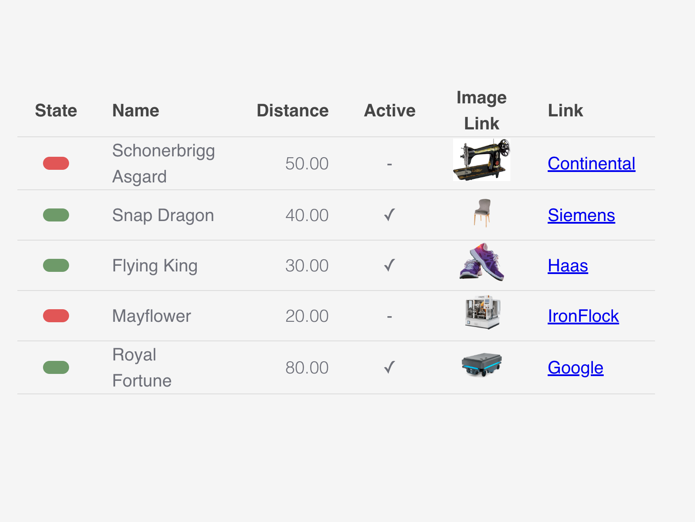

# \<widget-table>

A Lit 3.x web component for rendering data tables with sortable columns, powered by Vaadin Grid. Part of the IronFlock widget ecosystem.



## Installation

```bash
npm i @record-evolution/widget-table
```

**Peer Dependencies:** This widget requires `@vaadin/grid` to be installed in your application.

## Usage

```html
<script type="module">
    import '@record-evolution/widget-table'
</script>

<widget-table-1.2.0></widget-table-1.2.0>
```

```javascript
const table = document.querySelector('widget-table-1.2.0')
table.inputData = {
    title: 'Device Status',
    subTitle: 'Current readings',
    columns: [
        {
            header: 'Device',
            type: 'string',
            values: [{ value: 'Sensor A' }, { value: 'Sensor B' }]
        },
        {
            header: 'Status',
            type: 'state',
            values: [{ value: 'ONLINE' }, { value: 'OFFLINE' }],
            styling: { stateMap: "'ONLINE': 'green', 'OFFLINE': 'red'" }
        },
        {
            header: 'Temperature',
            type: 'number',
            values: [{ value: '23.456' }, { value: '18.912' }],
            styling: { precision: 1 }
        }
    ]
}
```

## InputData Interface

```ts
interface InputData {
    title?: string
    subTitle?: string
    horizontalOverflow?: boolean
    styling?: {
        headerFontSize?: string // e.g. '14px'
        cellPaddingHorizontal?: string // e.g. '16px' or '1rem'
        cellPaddingVertical?: string // e.g. '8px' or '1rem'
    }
    columns?: Column[]
}

interface Column {
    header: string
    type: 'string' | 'number' | 'boolean' | 'state' | 'button' | 'image'
    values: { value: string; link?: string }[]
    styling?: {
        precision?: number // Decimal places for number type
        stateMap?: string // e.g. "'ONLINE': 'green', 'OFFLINE': 'red'"
        width?: string // Column width e.g. '150px'
        fontSize?: string
        fontWeight?: string // e.g. '800' for bold
        color?: string // Font color
        border?: string // e.g. '1px solid red'
    }
}
```

## Column Types

| Type      | Description                                         |
| --------- | --------------------------------------------------- |
| `string`  | Plain text display                                  |
| `number`  | Numeric value with optional precision formatting    |
| `boolean` | Boolean display                                     |
| `state`   | Status indicator with colored dot based on stateMap |
| `button`  | Clickable button with optional link                 |
| `image`   | Image display with optional link                    |

## Features

- **Sortable columns**: Click headers to sort ascending/descending
- **Resizable columns**: Drag column borders to resize
- **Horizontal overflow**: Enable scrolling for wide tables
- **Theme support**: Integrates with IronFlock theming system
- **State indicators**: Visual status dots with customizable color mapping

## Theming

The widget respects CSS custom properties:

- `--re-text-color`: Text color override
- `--re-tile-background-color`: Background color override

Pass a theme object for ECharts-style theming:

```javascript
table.theme = {
    theme_name: 'dark',
    theme_object: {
        /* theme config */
    }
}
```

## Development

```bash
npm run start    # Dev server at localhost:8000/demo/
npm run build    # Production build to dist/
npm run types    # Regenerate types from schema
npm run release  # Build, bump version, git push & tag
```

## Local Demo

```bash
npm start
```

Serves the demo at `demo/index.html` with sample data.
